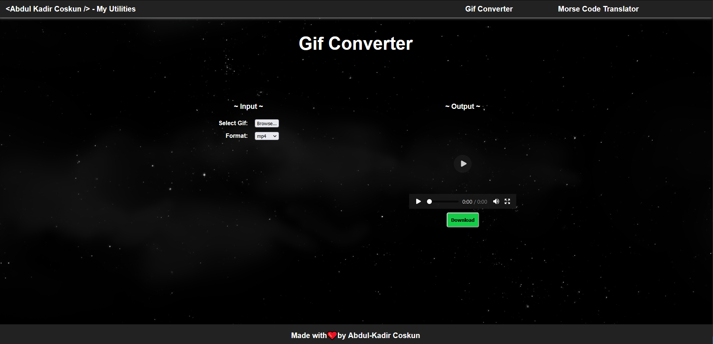

# Gif Converter

An online tool to provide easy gif conversion to different formats.

## Description

This tool was designed to convert gifs to mp4s and pngs. It was created to help with the creation of videos for my [Unity tutorials](https://www.youtube.com/playlist?list=PLzbRW-gm6o9Zd2zhNnMzwr77xXzCzWJ2d) on [YouTube](https://www.youtube.com/channel/UC8__XEn9chu9LYDxFC4WzIA).

---

| Table of Contents               |
| ------------------------------- |
| [Functionality](#Functionality) |
| [Front End Tech](#FrontEndTech) |
| [License](#License)             |
| [Contributors](#Contributors)   |
| [Links](#Links)                 |
| [Screenshot](#Screenshot)       |

---

## Functionality

-   Converts gifs to mp4s and pngs
-   Supports gifs with transparency
-   Supports gifs with multiple frames
-   Supports gifs with multiple colors
-   Deploys to Github Pages using Actions.

## Improvements to be made

-   Add better mobile support
-   Improve SCSS styling and implementation.

## Front End Tech

-   Javascript
-   HTML
-   SCSS
-   React
-   Node.js

## License

## Contributors

-   Abdul-Kadir Coskun <https://github.com/chizaruu>

### Github Repository

<https://github.com/chizaruu/gif-converter>

### URL

<https://chizaruu.github.io/gif-converter/>

### Screenshot

